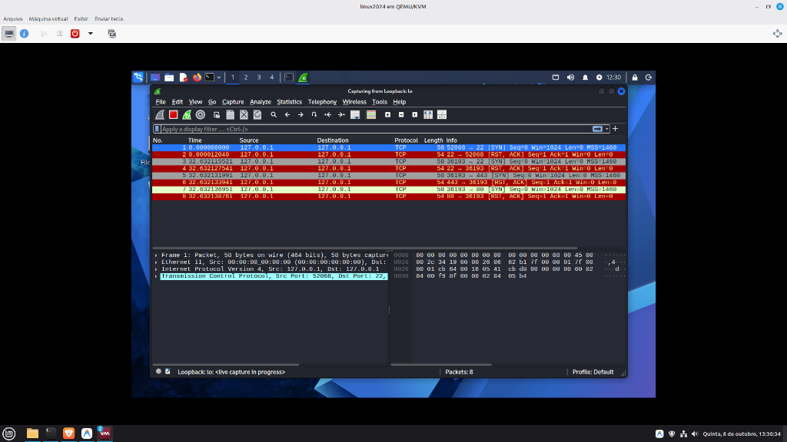

# 🛡️ Relatório Técnico: Análise de Tráfego de um SYN Scan (Nmap)

**Data:** 08 de Outubro de 2026
**Autor:** Hugo Gabriel Cunha Alves
**Função:** Analista de Suporte de TI / Foco em SOC N1

---

## 🎯 1. Objetivo do Laboratório
O objetivo deste exercício foi capturar e analisar o comportamento de rede de uma varredura furtiva de portas (*Stealth SYN Scan*) utilizando a ferramenta **Nmap**. O tráfego foi interceptado e inspecionado em nível de pacote através do **Wireshark**.

Para evitar vazamentos e respeitar diretrizes de *OpSec* (Segurança Operacional), o alvo do ataque foi a própria interface de loopback (`127.0.0.1`) de uma máquina virtual isolada (Kali Linux).

---

## ⚙️ 2. Metodologia e Comandos Executados
Foi executado o seguinte comando no terminal do atacante:

```bash
sudo nmap -sS -p 22,80,443 127.0.0.1
```

**Análise do Comando (Dissecação):**
- `sudo`: Necessário para forjar pacotes brutos TCP no nível do kernel.
- `nmap`: Network Mapper, a ferramenta de varredura padrão da indústria.
- `-sS`: Define a varredura do tipo *SYN Scan*. O ataque tenta iniciar um *Three-Way Handshake*, mas não o conclui, visando não registrar logs na aplicação alvo.
- `-p 22,80,443`: Filtro de portas alvo (SSH, HTTP, HTTPS), evitando ruído na captura.
- `127.0.0.1`: Endereço de loopback (localhost).

Paralelamente, o Wireshark foi configurado para escutar na interface `lo` (loopback).

---

## 🔬 3. Análise de Tráfego (Packet Sniffing)
A captura de tráfego resultou no seguinte padrão de comunicação TCP, ilustrando perfeitamente a reação de um sistema com portas fechadas perante um SYN Scan.

**Comportamento Observado no Wireshark:**

1. **O Disparo (SYN):** A máquina atacante enviou pacotes TCP com a flag `[SYN]` definida para as portas de destino 22, 80 e 443 (Visível nas linhas de cor cinza).
2. **A Resposta (RST, ACK):** Como os serviços (SSH, servidor Web) não estavam rodando na máquina alvo, o sistema operacional respondeu imediatamente com pacotes vermelhos contendo as flags `[RST, ACK]`. 
3. O envio do `RST` (Reset) aborta a conexão na mesma hora, indicando para o Nmap que a porta está fechada (*Closed*). 



---

## 🏁 4. Conclusão Técnica
O laboratório demonstrou com sucesso o nível fundamental de como as ferramentas de varredura interagem com o protocolo TCP/IP. Identificar o envio de pacotes SYN anômalos que não completam o *Three-Way Handshake* é a base para a criação de regras de detecção em firewalls e SIEMs dentro de um SOC.

---
*Laboratório documentado como parte de estudos contínuos de Redes e Blue Team.*
